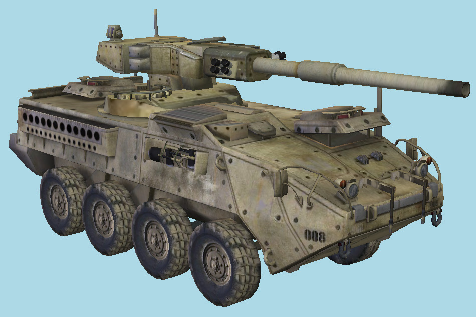

# Third Person Tower Defense

**Um jogo de tower defense onde o jogador pode defender o seu território indo para o campo de batalha!**

## Autores

- Pedro Lubaszewski Lima
- Thiago Frazzon Arend

## Data de Conclusão:

Julho, 2025

## Sumário:

- [Contribuições de cada Autor](#contribui%C3%A7%C3%B5es-de-cada-autor)
- [Uso de Inteligência Artificial](#uso-de-intelig%C3%AAncia-artificial)
- [Instalação](#instala%C3%A7%C3%A3o)
- [Funcionamento da Aplicação](#funcionamento-da-aplica%C3%A7%C3%A3o)
- [Conceitos de Fundamentos de Computação Gráfica Aplicados](#conceitos-de-fundamentos-de-computa%C3%A7%C3%A3o-gr%C3%A1fica-aplicados)

## Contribuições de cada Autor:

- **Seleção/importação de texturas e criação do cenário (paredes e estrada):** Thiago Arend
- **Seleção/importação dos modelos com texturas para o tanque, a torre, os balões e os tufos de grama:** Pedro Lima
- **Modelos de iluminação:** Pedro Lima
- **Todos os testes de colisão:** Thiago Arend
- **Movimentação dos balões:** Pedro Lima
- **Loop de gameplay:** Thiago Arend
- **Movimentação do tanque:** Thiago Arend

## Uso de Inteligência Artificial:

Para este projeto, utilizou-se o Gemini para gerar o código Python presente no arquivo ```utils/flip_faces.py```, utilizado para corrigir a orientação das faces de alguns modelos. Além disso, o ChatGPT foi usado para entender e replicar o padrão de geração dos planos do cenário. Para esses usos que são mais básicos e repetitivos, esses modelos de Inteligência Artificial se desempenharam muito bem, otimizando a produtividade dos membros do projeto. Esse tipo de uso não prejudicou as experiências necessárias para o aprendizado da disciplina.

## Instalação:

Para instalar e rodar a aplicação, basta baixar os arquivos do repositório e realizar os seguintes comandos na pasta do repositório:

- Linux (GNOME):

```
make run
```

## Funcionamento da Aplicação:

Com a aplicação aberta, o jogador se depara com uma câmera fixa observando a torre, o tanque e a rua por onde os balões inimigos passarão:


Nesse contexto, tanto a torre, quanto o tanque estão com as suas vidas cheias. O jogo consiste em defender a torre atirando nos balões através do tanque. Para controlar o tanque, existem as seguintes teclas:

| Tecla | Ação |
| --- | --- |
| <kbd>←</kbd> / <kbd>↑</kbd> / <kbd>→</kbd> / <kbd>↓</kbd> | Mover o tanque na direção indicada pelas flechas. Para realizar uma curva, é necessário pressionar as teclas horizontais junto das teclas verticais. |
| <kbd>espaço</kbd> | Atirar na direção para a qual o canhão do tanque está apontado. |

Pode-se utilizar também as seguintes opções de câmera na aplicação através das teclas abaixo:

| Tecla | Ação |
| --- | --- |
| <kbd>C</kbd> | Câmera totalmente livre, controlada por <kbd>W</kbd> / <kbd>A</kbd> / <kbd>S</kbd> / <kbd>D</kbd> e pela direção apontada pelo arraste do mouse (através do botão esquerdo do mouse). |
| <kbd>V</kbd> | Câmera em terceira pessoa sobre o tanque. |
| <kbd>B</kbd> | Câmera fixa sobre todo o cenário. |

Ao selecionar a câmera em terceira pessoa, logo após disparar um tiro, obtém-se a seguinte visão do jogo:


Como visto pelas figuras acima, há uma certa pontuação registrada. Cada balão inflige uma quantidade de dano distinta e também pontua de forma distinta. Ao atingir um certo valor de pontuação, o jogador vence o jogo:


Caso a vida da torre chegue a zero, o jogo é perdido:


Caso queira sair do jogo à qualquer momento, basta pressionar a tecla <kbd>ESC</kbd>.

## Conceitos de Fundamentos de Computação Gráfica Aplicados:

O sistema foi desenvolvido através da linguagem C++, gerenciador de processamento gráfico OpenGL, com gerenciador de janelas GLAD, tipos providos pela biblioteca GLM e carregador de arquivos TinyObjectLoader. Os modelos utilizados na aplicação são ilustrados a seguir:





A maioria desses modelos advêm do site [RigModels](https://rigmodels.com/). Sendo que pelo menos a torre e o tanque têm geometrias complexas (aproximadamente 10.000) faces.

Além disso, o cenário do jogo conta com a utilização de mais de uma instância do mesmo objeto (os tufos de grama):

```
model = Matrix_Translate(12500.0f, -4850.0f, 4500.0f) *
        Matrix_Scale(5.0f, 5.0f, 5.0f);
glUniformMatrix4fv(g_model_uniform, 1, GL_FALSE, glm::value_ptr(model));
glUniform1i(g_object_id_uniform, GRASS);
DrawVirtualObject("grass");

model = Matrix_Translate(7500.0f, -4850.0f, 1000.0f) *
        Matrix_Scale(5.0f, 5.0f, 5.0f);
glUniformMatrix4fv(g_model_uniform, 1, GL_FALSE, glm::value_ptr(model));
glUniform1i(g_object_id_uniform, GRASS);
DrawVirtualObject("grass");

model = Matrix_Translate(6000.0f, -4850.0f, 6000.0f) *
        Matrix_Scale(10.0f, 10.0f, 10.0f);
glUniformMatrix4fv(g_model_uniform, 1, GL_FALSE, glm::value_ptr(model));
glUniform1i(g_object_id_uniform, GRASS);
DrawVirtualObject("grass");

model = Matrix_Translate(14000.0f, -4850.0f, 7000.0f) *
        Matrix_Scale(7.5f, 7.5f, 7.5f);
glUniformMatrix4fv(g_model_uniform, 1, GL_FALSE, glm::value_ptr(model));
glUniform1i(g_object_id_uniform, GRASS);
DrawVirtualObject("grass");        

model = Matrix_Translate(12000.0f, -4850.0f, 0.0f) *
        Matrix_Scale(3.50f, 3.5f, 3.5f);
glUniformMatrix4fv(g_model_uniform, 1, GL_FALSE, glm::value_ptr(model));
glUniform1i(g_object_id_uniform, GRASS);
DrawVirtualObject("grass");
```

Ao jogar o game, o tanque é controlado de forma não trivial pelo jogador através de transformações geométricas. Além disso, a aplicação tem uma mecânica completa com o seu loop de gameplay.

Também há a presença de três tipos de câmeras distintas descritas com mais detalhes na seção anterior.

Sobre as colisões, foram realizados três tipos distintos de colisões (no arquivo ```src/colisions.cpp```):

- Paralelepipedo-Plano:
```
bool BBox_Intercepts_Plane(const std::vector<glm::vec3> world_corners, const glm::vec4 plane)
{
    int num_front_vertices = 0;
    int num_back_vertices = 0;

    for (int i = 0; i < 8; i++)
    {
        // define a normal n do plano
        glm::vec4 plane_n = glm::vec4(plane.x, plane.y, plane.z, 0.0f);
        // define o vetor posição p do ponto
        glm::vec4 point_p = glm::vec4(world_corners[i].x, world_corners[i].y, world_corners[i].z, 0.0f);

        // calcula distancia di entre o ponto da bbox e o plano,
        // conforme a eq. di = (n⋅p) ​​+ d
        float d = glm::dot(plane_n, point_p) + plane.w;

        if (d > 0.0f) 
            num_front_vertices++;
        else if (d < 0.0f) 
            num_back_vertices++;

        if (num_front_vertices > 0 && num_back_vertices > 0)
            return true;
    }

    return false;
}
```

- Esfera-Plano:
```

```

- Paralelepipedo-Paralelepipedo:
```
bool BBox_Intercepts_BBox(const std::vector<glm::vec3>& bbox1, const std::vector<glm::vec3>& bbox2)
{
    // limites extremos para bbox1
    float min1_x = std::numeric_limits<float>::max();
    float max1_x = std::numeric_limits<float>::lowest();
    float min1_z = std::numeric_limits<float>::max();
    float max1_z = std::numeric_limits<float>::lowest();

    // limites extremos para bbox2
    float min2_x = std::numeric_limits<float>::max();
    float max2_x = std::numeric_limits<float>::lowest();
    float min2_z = std::numeric_limits<float>::max();
    float max2_z = std::numeric_limits<float>::lowest();    

    // min/max em XZ para bbox1
    for (const glm::vec3 v : bbox1) {
        min1_x = std::min(min1_x, v.x);
        max1_x = std::max(max1_x, v.x);
        min1_z = std::min(min1_z, v.z);
        max1_z = std::max(max1_z, v.z);
    }

    // min/max em XZ para bbox2
    for (const glm::vec3 v : bbox2) {
        min2_x = std::min(min2_x, v.x);
        max2_x = std::max(max2_x, v.x);
        min2_z = std::min(min2_z, v.z);
        max2_z = std::max(max2_z, v.z);
    }

    // verifica sobreposição nos eixos X e Z
    bool x_overlap = (max1_x >= min2_x) && (min1_x <= max2_x);
    bool z_overlap = (max1_z >= min2_z) && (min1_z <= max2_z);

    return x_overlap && z_overlap;
}
```

Sobre a iluminação dos objetos, todos possuem iluminação difusa texturizada (há texturas para cada um dos objetos, mesmo o projetil do canhão). Os planos de grama e os tufos de grama também contam com textura para iluminação especular. Os balões, a grama, os tufos de grama e o projetil apresentam modelo de iluminação de Blinn-Phong. Todos os objetos exceto a torre apresentam interpolação de Phong (fragmento a fragmento), enquanto que a torre apresenta interpolação de Gourad (vértice a vértice).

Os balões se movimentão através de duas curvas cúbicas de Bezier por partes:

- No ```include/bezier.h```:
```
glm::mat4 Bezier_Translate(float t, float speed, glm::vec4 p1, glm::vec4 p2, glm::vec4 p3, glm::vec4 p4)
{
    glm::vec4 position = bezier_position(t, speed, p1, p2, p3, p4);
    return Matrix_Translate(position.x, position.y, position.z);
}
```

- Na ```src/main.cpp```:
```
model = Bezier_Translate(ballon_red_time, ballon_red_speed, bezier_p1, bezier_p2, bezier_p3, bezier_p4) *
        Matrix_Rotate_Y(g_AngleY + current_time * 0.8f) *
        Matrix_Scale(200.0f, 200.0f, 200.0f);
glUniformMatrix4fv(g_model_uniform, 1, GL_FALSE, glm::value_ptr(model));
glUniform1i(g_object_id_uniform, BALLON_RED);
if (g_GameLoopIsOn && ballon_red_is_visible)
    DrawVirtualObject("ballon_red");
```

Por fim, todas as animações e ações sensíveis ao tempo foram calculadas a partir de um $` \Delta t `$. Isso foi feito para que a aplicação se comporte de forma idêntica em qualquer máquina que rodar. Esse fato é ilustrado abaixo por um exemplo de trecho de código:

```
current_time = (float)glfwGetTime();
delta_t = current_time - previous_time;
previous_time = current_time;
if (g_UseFreeCamera)
{
    // Câmera livre
    camera_view_vector = glm::vec4(x, -r - y, z, 0.0f); // Ponto "c", centro da câmera
    camera_w = -camera_view_vector;
    camera_u = crossproduct(camera_up_vector, camera_w);
    if (g_WKeyPressed)
        camera_position_c += camera_speed * delta_t * -camera_w;
    if (g_SKeyPressed)
        camera_position_c += camera_speed * delta_t * camera_w;
    if (g_AKeyPressed)
        camera_position_c += camera_speed * delta_t * -camera_u;
    if (g_DKeyPressed)
        camera_position_c += camera_speed * delta_t * camera_u;
}
...
if (g_UpKeyPressed)
{
    g_TankPosition += tank_direction * tank_speed * delta_t;
    if (glfwGetKey(window, GLFW_KEY_LEFT) == GLFW_PRESS)
    {
        g_TankRotationAngle += tank_rotation_speed * delta_t;
    }
    else if (glfwGetKey(window, GLFW_KEY_RIGHT) == GLFW_PRESS)
    {
        g_TankRotationAngle -= tank_rotation_speed * delta_t;
    }
}
...
ballon_red_time += delta_t;
if (ballon_red_time > 2.0f / ballon_red_speed)
    ballon_red_time = 0.0f;
```

Para concluir, esse trabalho realmente versou sobre quase todo o conteúdo visto na disciplina e serviu como grande aprendizado para o grupo. O grupo teve bastantes dificuldades ao carregar os arquivos ```.obj``` inicialmente e com a ideia de utilizar um cenário muito complexo (que foi bem simplificado na ideia final). Mesmo não implementando um jogo bem completo como era a ideia inicial, o projeto foi concluído com êxito, cumprindo todos os requisitos técnicos exigidos.
